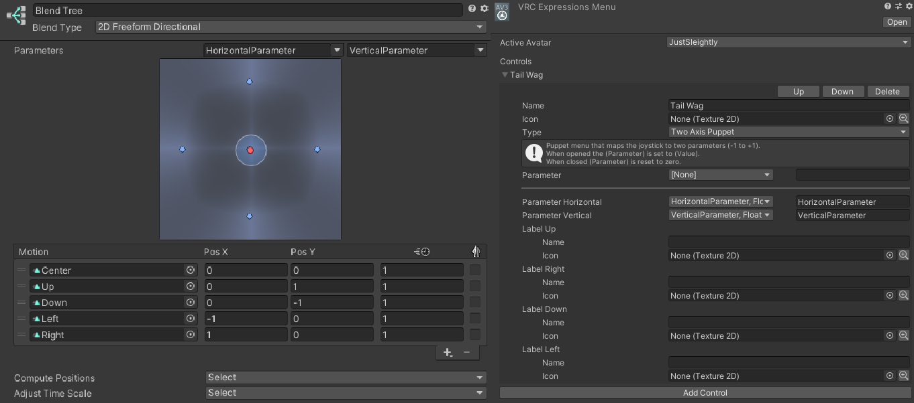
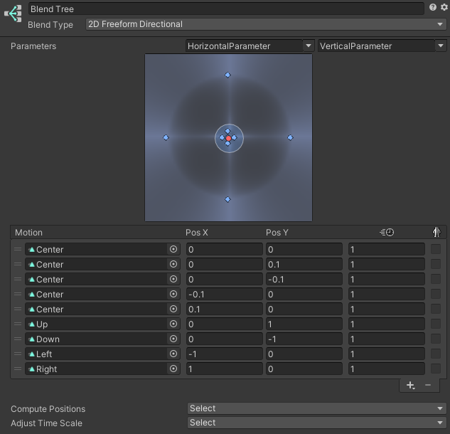

Contributors: [Jellejurre](https://jellejurre.dev/), [JustSleightly](https://vrc.sleightly.dev/)

# 2-Axis Puppets {#0ace46b18d1e4ce29d1e7f5f31493e45}

2-Axis Puppets are a type of Expression Menu Control (See [Expressions Menu and Parameters](/docs/Avatars/Expressions-Menu-Params)) that allow you to set a combination of 2 floats based on the direction of a puppet’s thumbstick. This article will go over some common use cases and how to set them up.

This article will assume you know how to record certain values into Animation Clips. If you don’t know this, a step by step guide is given in the [Animation Clips](/docs/Unity-Animations/Animation-Clips) article.

The most common way of utilizing a 2-axis puppet is using a **2D Blend Tree**.

---

## 2D Blend Tree {#a4e887b48ee541c9aa81a80ff61a147c}

With a 2D Blend Tree animation, in a standard example you will need at least five animations, each representing a different position of the thumbstick: **Up, Down, Left, Right, Center.** 

To use this blend tree for a Tail Control, make sure your 2-Axis Puppet Horizontal and Vertical Parameters are added to your FX layer as Floats, and add a new layer. Set the layer weight to 1 by clicking on the Gear icon, and dragging the Weight to 1. 

Then, select your new layer, give it a new name by double clicking it, and create a new state in the layer with a blend tree by `Right Clicking` → `Create State` → `From New Blend Tree`,  which will have as its Blend Type set to `2D Freeform Directional`, its children as the five animations described above, and its Blend Parameters as 2-Axis Horizontal and Vertical Parameters.

The five animations should be given X/Y Position values that put them at their respective directions from the center (see example image).

Depending on the sensitivity of a user’s thumbstick, it may be a good idea to incorporate **deadzones** around the center animation.

This examples also demonstrates that the 2D Blend Tree is not limited to specifically 5 animation clips, but any number above or below as well. Additional clips can be added at the diagonals, or in between each other depending on how far the thumbstick is pressed.

---

### Applications of 2-Axis Puppets {#b79f895b35fc47e28cb1792b4d359dd2}

Anything that you can animate in an animation clip can be manipulated by a 2-Axis Puppet. For some examples, see [Types of Animation Clips](/docs/Unity-Animations/Types-Of-Animations).

Below are some common use cases

---

#### Transforms

2-Axis puppets are often used to move objects around, such as manual tail wagging, ear control, eye control, and other body parts.

---

#### Drone Movement

A more advanced application that is also a common use of 2-axis puppets is to control an objects movement in world space. Flying drones, RC cars, remote control followers, flying cameras, and more all use 2-axis puppets to control this movement.

Puppet menus can also be opened in each hand and controlled with separate thumbsticks, to simulate a dual thumbstick controller.

---

## 4-Axis Puppets {#0b9dffcd56a147a8a0ef38118546d2f9}

4-Axis Puppets are a type of Expression Menu Control (See [Expressions Menu and Parameters](/docs/Avatars/Expressions-Menu-Params)) that allow you to set a combination of 4 floats based on the direction of a puppet’s thumbstick.

There are no typical uses for 4-Axis puppets since there aren’t exactly 4D Blend Trees, so 4-Axis puppets are typically used for concepts that do not represent different directions, perhaps using [Expression Parameter Mismatching](/docs/Other/Parameter-Mismatching).

The most common use of 4-Axis puppets is ironically not to use the puppet itself, but to [force IK Sync rate](https://creators.vrchat.com/avatars/animator-parameters/#sync-types) for all of the puppets’ floats. This is typically used for VRC Face Tracking users.

---
<RightAlignedText>Last Updated: 31 March 2024 08:54:00</RightAlignedText>