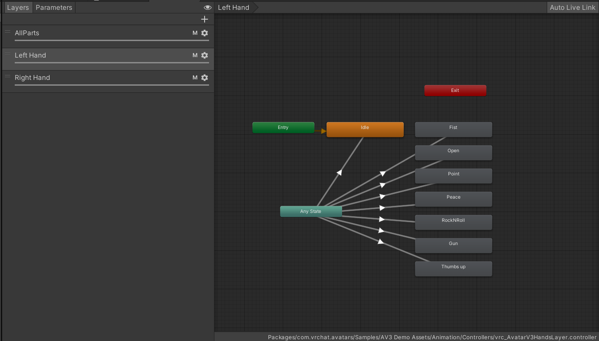

Contributors: [Jellejurre](https://jellejurre.dev/), [JustSleightly](https://vrc.sleightly.dev/)

# Hand Gestures/Facial Expressions {#5783634f5f91468f8409b1206010953c}

## Hand Gestures {#fed71700785b413eb7339bfbc4685022}

Hand Gestures are done on your average avatar by animating the humanoid bones on the Gesture Playable Layer. Generally, it is done by copying (`Ctrl+D`) the vrc_AvatarV3HandsLayer (or vrc_AvatarV3HandsLayer2) controller from the samples, and editing it by putting the desired animations in the right slots.

The difference between the two sample controllers is that they have slightly different idle animations.

:::note

These Animator Controllers use Proxy animations. That is, animations that don’t contain the full data in Unity, but get swapped out at runtime with the full ones. So making copies and editing them is futile.

:::

If you look at the animations, you’ll see that both hands have animations for both hands, so you would expect both layers to affect both hands, however, that is not the case.

This is because of the masks used on the layers. The mask on the top layer applies to the whole animator, and the masks on the other layers apply on a layer by layer basis. More information can be found on the [Avatar Masks](/docs/Avatars/Avatar-Masks) page, but the main point is that the Left Hand layer is only allowed to interact with the left hand humanoid bones, and the Right Hand layer is only allowed to interact with the right hand humanoid bones.

On Index Controllers, the Animation State of the hands is set to Tracking by default, which means that any animation affecting the hand gets overwritten by the tracking of the Index Controllers. If you want animations to control the hands on Index Controllers, you have to set the Tracking Control of Left Fingers or Right Fingers to Animated with a Animator Tracking Control. More information can be found on the [VRC State Behaviours](/docs/Avatars/State-Behaviours) page. 

 <GreyItalicText>The default VRChat Hands layer 1.</GreyItalicText>

---

## Facial Expressions {#9c999dd0c6074612aeb58eb63d003d73}

Many avatar creators copy the Gesture layer, creating [Animation Clips](/docs/Unity-Animations/Animation-Clips) for facial animations, and slot it into the FX layer.

This, however, is sadly not ideal. 

- First of all, the remaining Hands masks can interfere with WD off Transform animations on the FX Layer, and should be removed.
- Second of all, since both hands control the face, you can have animations merging together. (Say for example you have an animation playing on the Left Hand layer that raises an eyebrow, and another on the Right Hand layer that closes the eyes, then one eye will be both closed and raised, causing weird effects).

There are three fixes for this:

- Always animating every blendshape at every animation, so setting unused blendshapes to 0, with the idle animation containing a buffer animation (an animation which animates a non-existing GameObject)
- Adding logic to your Animator Controller to let one hand take control over the other (so make it so Right Hand can only get out of Idle when the Left Hand is idle)
- Using a tool like [Hai’s ComboGestureExpressions](https://hai-vr.github.io/combo-gesture-expressions-av3/) to explicitly decide which animations get played with which hand combination

Note: The first 2 make it so one hand always takes priority over the other, unless it is idle, then the other hand takes over.

### Animating Facial Expressions with WD Off {#fe3179c3c7364871bbb1e61a3d426224}

Using WD off, facial expressions can be animated in a few ways, but here are some pointers:

- Have a reset layer which is positioned above the two face layers, and is constantly playing an animation which sets all blendshapes to 0
- Have the idle state animate a buffer animation, (an animation which animates a non-existing GameObject)

If you follow these tips, along with one of the solutions in the above paragraph, every blendshape will either:

- Be animated to 0 by the reset layer

OR

- Be animated to the required value by one of the face layers

 <GreyItalicText>An example Buffer Animation Clip</GreyItalicText>

Therefore you should never have facial animations getting “stuck”, a.k.a. not resetting back to 0 when they are done playing. This can also be caused by mixed write defaults, since they generally behave like WD off. More information can be found on the [Write Defaults](/docs/Unity-Animations/Write-Defaults) page.

---
<RightAlignedText>Last Updated: 31 March 2024 08:54:00</RightAlignedText>