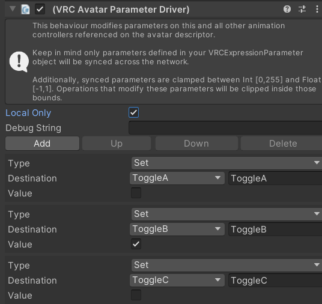
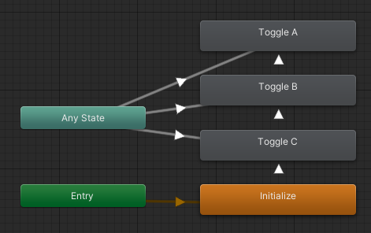

Contributors: [Jellejurre](https://jellejurre.dev/), [JustSleightly](https://vrc.sleightly.dev/)

# Multi-Toggles {#1613fa45ccbd46c580fc25482e564ac2}

A Multi-Toggle is an exclusive toggle. This means that only one of the list of objects is enabled at once. This can be done with either multiple toggles or with a Radial Puppet. Information on how to do this with a Radial Puppet can be found on the [Radial Puppets (Hue Shifts and more)](/docs/Avatars/Radial-Puppets) page. 

There are three different ways to use synced memory to make a multi-toggle:

- Multiple Bools (best simple one if you have fewer than 8 toggles)
- Integer (best simple one if you have more than 8 toggles)
- Binary Bools (best for space, but also most convoluted)

This article will cover methods that use Multiple Bools or Integer, since the space saved by Binary multi-toggles is usually not worth the effort unless you’re extremely strapped for memory space.

---

## Multi-Layer {#7dbc8e7c32de46d5a4c21af8eb736a30}

Converting a multiple Simple Toggles (as outlined in [Toggles](/docs/Avatars/Toggles)) into a Multi-Toggle is quite simple, and even works with Dissolve Toggles. All you have to do is add a Parameter Driver to the Object On state which Sets itself to enabled and all the other toggles to disabled.

Note that if you have some toggles where the Parameter being on means the Object is off, you will need to flip their behaviour (so set them to True on the other Layers and False on its own Layer).

Pros:

- Uses less memory than the Single Layer setup, as long as you have fewer than 8 toggles
- More versatile, allows for customization of the Parameter Drivers to perform other actions as well
- Easiest to convert a bunch of Basic Toggles to Exclusive
- Works with dissolve toggles

Cons:

- Less optimized for performance than the Single Layer setup

 <GreyItalicText>An example VRC Avatar Parameter Driver for a Multi Toggle on the Object On state of Toggle B</GreyItalicText>

---

## Single Layer {#87473337f1a643899a782da97756d37e}

The Single Layer setup is the fastest and simplest, but will require completely setting up your toggles again if you’re using a bunch of Basic Toggles which you want to convert.

This setup has two versions, the AnyState version, and the Blend Tree version.

Both will require you to set up one Animation per object, where that Animation enables one object and disables every other object with two identical keyframes, one after the other.

 <GreyItalicText>An example Animation for the Toggle C object</GreyItalicText>

---

### Single Layer AnyState {#e5096f2c6d7f4ec694ff834015a2aaf1}

This setup is faster than the Multi-Layer one, but less fast than the Blend Tree one. It is made using multiple bools in both your Expression Menu and your Controller.

Copy the setup on the right, where every Any State Transition has Can Transition To Self disabled and all Transitions have Exit Time disabled and a Transition Duration of 0.

Every Transition from Any State to a Toggle State has as condition that that Toggle’s Bool is enabled, and every Self Transition has as condition that the Toggle’s Bool is disabled.

Every State has a Parameter driver which drives its Toggle Bool back on, just in case you disable the current value, it’ll automatically re-enable.

A template for this example can be found at [Multi-Toggle (Exclusive w/o Disable)](https://notes.sleightly.dev/justsleightly/Multi-Toggle-Exclusive-w-o-Disable-1ea7a2ca9ef643d083e0328b55f9918d).

Pros:

- Almost the fastest
- The most memory efficient one under 8 toggles
- Has automatic re-enable upon disable
- Allows for the use of Parameter Drivers for different States

Cons:

- No dissolve toggles
- Harder to convert an existing set of Basic Toggles

 <GreyItalicText>The Single Layer Multi Toggle setup</GreyItalicText>

---

### Single Layer Blend Tree {#380b3ba8ece541c1aeac8fc2f0b0258b}

This setup is the fastest out of all of them. It is made by having the Int in your Expression Menu be a Float in your Controller. This works due to [Expression Parameter Mismatching](/docs/Other/Parameter-Mismatching).

Then, on a new layer, create a new state, then, on the state, `Right Click` → `Create new Blend Tree in State`. Then, double click the Blend Tree in the Motion field, and set up the blend tree as seen on the right.

Note that Automate Thresholds is disabled, and every Animation has the Threshold that gets set by your Toggle in your Expression Menu.

Pros:

- The fastest
- The simplest (arguably)

Cons:

- No dissolve toggles
- Least memory efficient one under 8 toggles
- Less versatile, doesn’t allow for the use of Parameter Drivers
- Harder to convert an existing set of Basic Toggles

 <GreyItalicText>A Multi-Toggle Blend-Tree</GreyItalicText>

---
<RightAlignedText>Last Updated: 31 March 2024 08:54:00</RightAlignedText>