Contributors: [Jellejurre](https://jellejurre.dev/), [JustSleightly](https://vrc.sleightly.dev/)

# Uploading an Avatar in 3.0 {#bd905661d5ac439c98282dc6d00a148e}

This guide provides a step-by-step walkthrough for uploading your avatar with Avatar 3.0, utilizing the VRChat Creator Companion (VCC), a powerful tool provided by VRChat for accessing the latest versions of packages and tools, including the SDK.

**Terminology:**

- **Unity:** The game engine utilized by VRChat.
- **Unity Editor:** The program used for avatar uploads.
- **Package:** A collection of files added to the Unity Editor, which can include software, avatars, shaders, or other Unity assets.
- **Avatar SDK:** A VRChat package encompassing everything necessary for uploading a basic avatar.
- **Base SDK:** A required package for the Avatar SDK to function.
- **VRChat Creator Companion:** A VRChat program designed to streamline the setup of the Unity Editor and Avatar SDK, potentially extending to other packages in the future.

## Install The Creator Companion {#750908c4961340139d0f317793923f69}

### Download the Creator Companion {#889d421d6bcb478f866d3a0137147454}

To install the creator companion, go to https://www.vrchat.com, click `Log In`, log in, and go to the Downloads section

 <GreyItalicText>How to get to the downloads section.</GreyItalicText>

Then, scroll down and Click the `Download the Creator Companion` Button.

 <GreyItalicText>The Creator Companion download button</GreyItalicText>

### Run the Creator Companion installer {#636bfc7248a54584a6c09643d061dede}

Run the file downloaded (it should be called _VRChat_CreatorCompanion_Setup_[numbers].exe_), select `Install for me Only (Recommended)`, accept the license agreement, and select an install folder and a Start menu folder. It is fine to leave these on the defaults.

## Set up the Creator Companion {#6c2cb42d376c4111819a48516b15478f}

### Run Setup {#8379d4df0dad4e398032e773135312cd}

Once the installation is complete, the Creator Companion should start. (If not, you can launch it from your start menu). 

On first launch, it will set everything up for you. 

Once you see the Welcome screen, press “Show me around”. 

The creator companion will tell you where to find important tabs, like your Projects or the Settings.

 <GreyItalicText>The Creator Companion Welcome screen</GreyItalicText>

After a few seconds, you can press `Continue` to go to the setup.

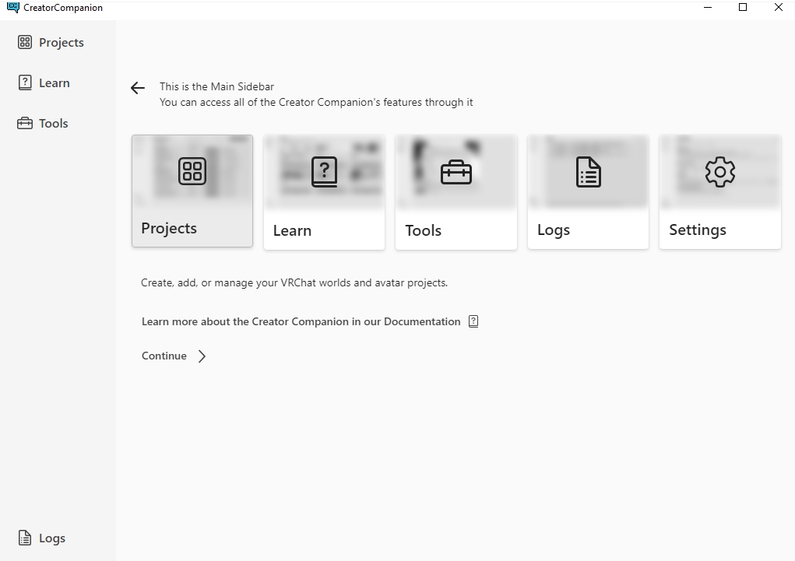 <GreyItalicText>The Creator Companion Introduction screen.</GreyItalicText>

If the Unity Editor is not found, it will say `Unity Editor Not Found`, and here you can press Continue again. 

If you do have the Unity Editor installed, you can move on to  . 

After pressing continue, you can press `Install Unity` to bring you to the Unity Hub Installation screen.

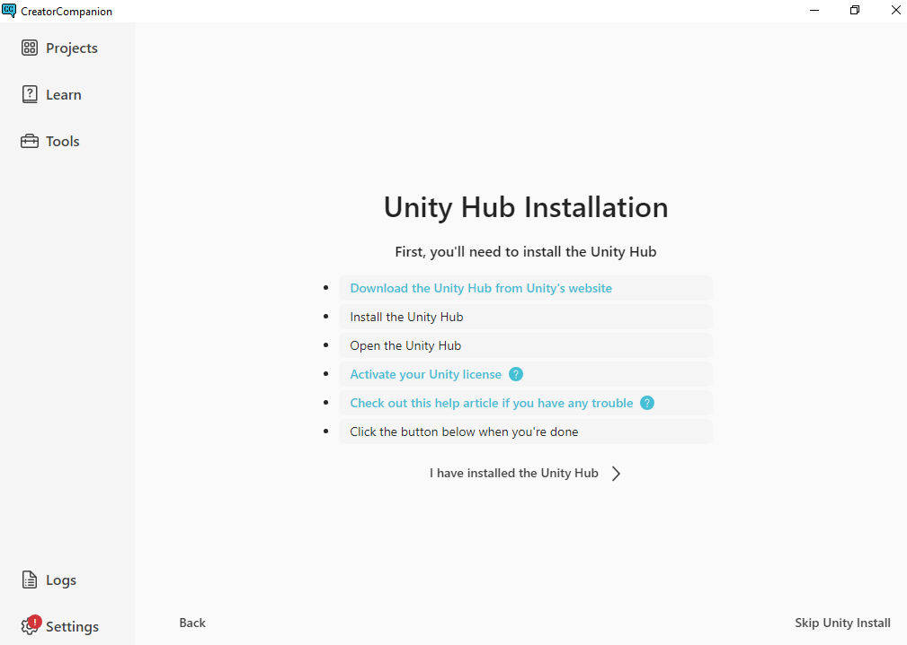 <GreyItalicText>The Creator Companion Unity Hub Installation Screen</GreyItalicText>

### Install Unity Hub {#05ec32fccd024aa4aa583eeec5ee3cfa}

To install the Unity Hub, click on the `Download the Unity Hub from Unity's website` link or go [Here](https://unity.com/download) and press the `Download` button. 

Then run the program you’ve downloaded (called `UnityHubSetup.exe`). In the install window, agree to the License Agreement, select an install folder, and press Install. Finish the setup and open Unity hub. 

:::caution

This install folder will be where Unity will install its Unity Editors. Note that this folder can take up to 10 GB per editor version (usually only 1)

:::

### Create a Unity Account {#59cb87a325a84085b294cd713eb92f8e}

In the Unity Hub, press the Create Account button. This will bring you to the Unity Website. 

On there, fill in your details, complete the CAPTCHA, check the required boxes, and click `create a Unity ID`. 

Then go to your email and click the confirm link. 

Now, go to your Unity Hub program, and sign in with your new account. 

If you see the following popup, check `Always allow` [`api.unity.com`](http://api.unity.com/) `to open links of this type in the associated app` and press open.

This should sign you in to Unity Hub.

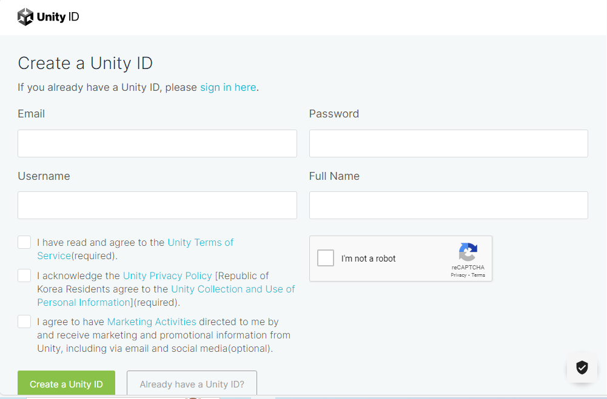 <GreyItalicText>The Unity ID Creation Website</GreyItalicText>

### Enable your Personal Unity License {#f5cd91589d094eebaf38da050193f49e}

In the Unity Hub, you will get asked to install a Unity version. 

You should not do this, as VRChat will do it for you in the Creator Companion. 

Check `Don't ask me again` and click `Skip Installation`. 

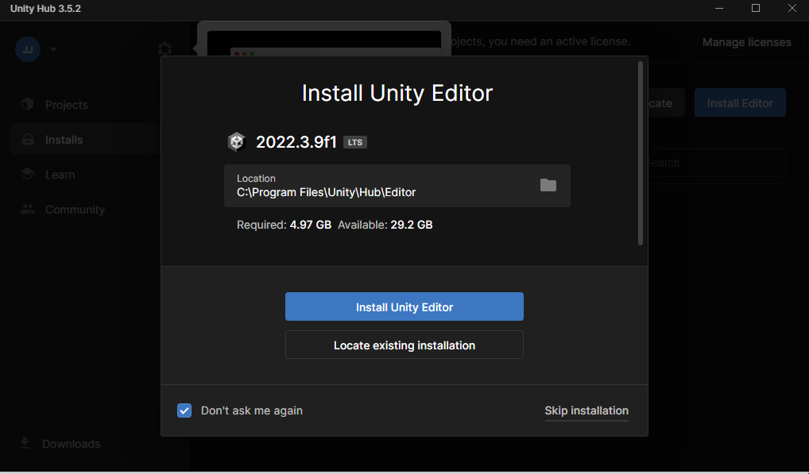 <GreyItalicText>The Install Editor screen. We do not want to do this.</GreyItalicText>

Unity will then show you a popup asking you to enable your Personal License. 

Click `Agree and get personal edition license`. 

Once this is done we can return to the Creator Companion app.

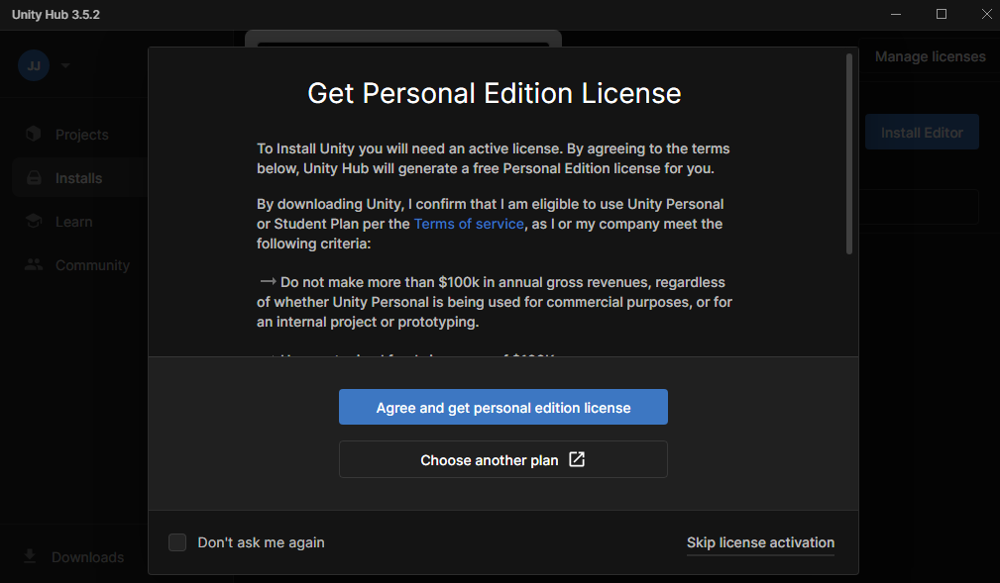 <GreyItalicText>The Get Personal License screen. We do want to do this.</GreyItalicText>

### Install Unity {#9d21787316b5429385ac68a3e4c7424f}

In the Creator Companion, click `I have installed the Unity Hub` and click the `Install Unity [Version]` button. This may take a while.

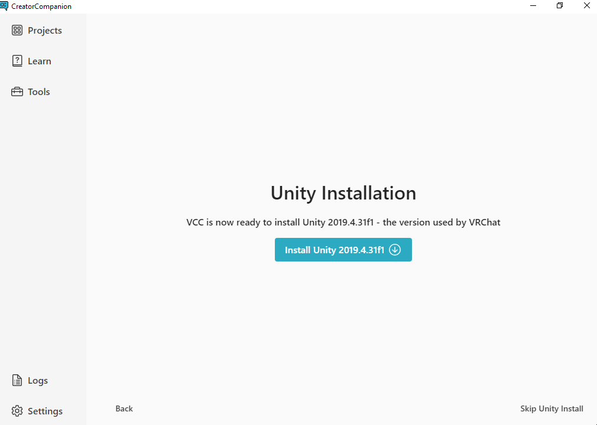 <GreyItalicText>The Install Unity Screen</GreyItalicText>

## Create your VCC Project {#5d6cd2ddd0f749c7bcec86d9ffc78b0c}

Once Unity is Installed, you will get shown a screen where you can Add or Create a project.

In this case, we want to create a new project.

Press the `Create New Project` button.

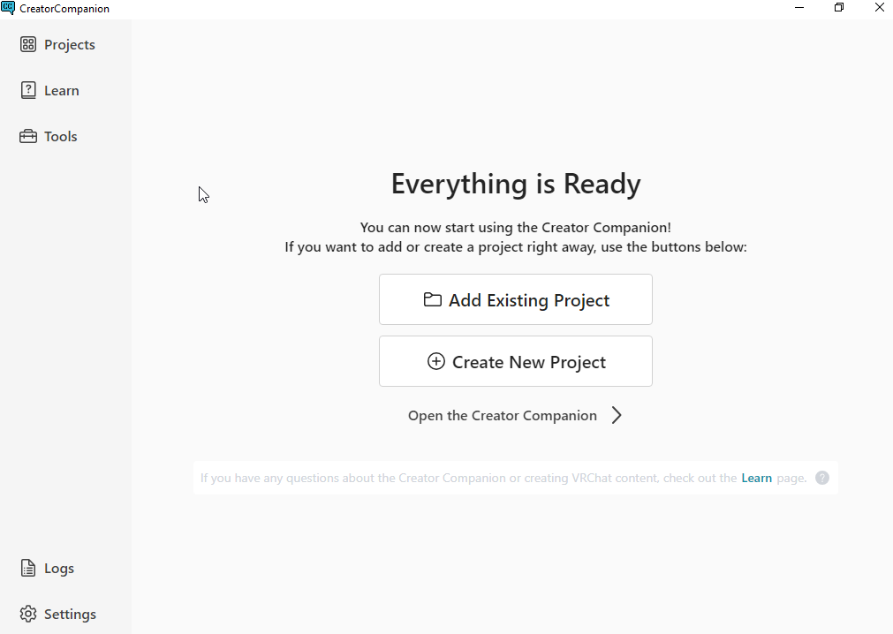 <GreyItalicText>The Add or Create Project Screen</GreyItalicText>

This will bring you to the Project Creation screen. In here, select `Avatars`, give the project a name, and select a project location. 

If you have the space for it, I recommend making this a location on an SSD, preferably even an m.2 SSD, but do note that this will contain your avatar and can grow up to multiple GBs.

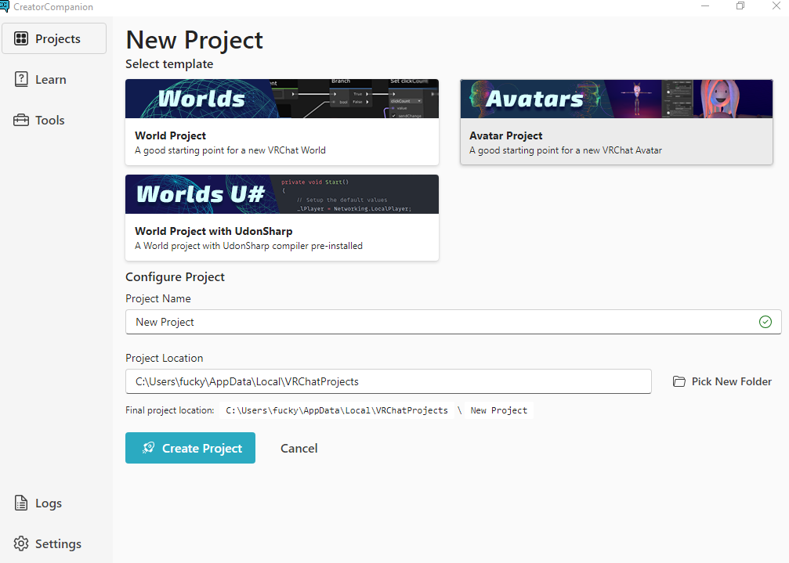 <GreyItalicText>The Project Creation Screen</GreyItalicText>

## Set up your VCC Project {#04109af77954446babff9db2e794c642}

### Launch Unity Editor {#bbabfa82d8d44046af02f1407dcde552}

You will be brought to the Project window. In this window, you can install, update and remove packages to your liking. 

An avatar project has the latest version of the Base SDK and Avatar SDK by default, so we don’t need to add anything here, and you can click `Open Project`.

 <GreyItalicText>The Project Window</GreyItalicText>

### Import required packages {#d194c13a3776457c9d7b0a96134a6433}

Now that you’ve opened your project, we need to import a few UnityPackage packages.

There are three methods for importing a UnityPackage.

1. Drag the UnityPackage from your Windows Explorer into the Project window at the bottom left of your screen
2. Go to `Assets` → `Import Package` → `Custom Package` and select your package in the Windows Explorer window that pops up
3. Double click the UnityPackage file (this one only works if your Open With program is set correctly and you only have one UnityProject open)

There are a few packages which might be required for your avatar to work. 

These will usually be described on the avatar’s website or purchase receipt. Some common ones are:

- **Poiyomi Toon Shader**: This is the most popular shader in the western market, and can be downloaded [Here](https://github.com/poiyomi/PoiyomiToonShader).
- **Dynamic Bones**: Older packages might use this, as it’s the predecessor to Phys Bones. You can use the VRLabs Dynamic Bones Stub, downloadable from [Here](https://github.com/VRLabs/Dynamic-Bones-Stub) (the components will not work inside the Unity Editor, but will work in game), or purchase the Dynamic Bone package [Here](https://assetstore.unity.com/packages/tools/animation/dynamic-bone-16743).
- **Poiyomi Pro Shader**: This is a more advanced version of Poiyomi Toon, which has access to more of the features. To download it, you need to be a patron of Poiyomi, join their discord server, and download the package from there. You can become their patron [Here](https://www.patreon.com/poiyomi/posts).
- **Gogo Loco**: Gogo Loco is a movement system that has more features than the default VRChat movement system. It can be downloaded [Here](https://franadavrc.gumroad.com/l/gogoloco).
- **VRC Fury**: VRC Fury is a non-destructive avatar build system. It can be downloaded [Here](https://vrcfury.com/download).

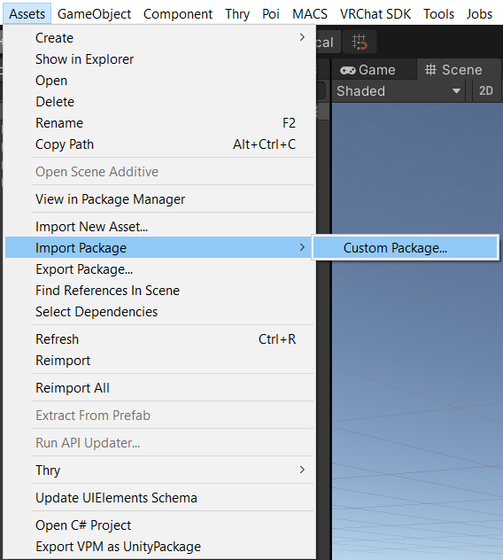 <GreyItalicText>Method 2 of importing a UnityPackage.</GreyItalicText>

Import the packages that are required for your avatar. Generally you can use the latest versions of these packages, except for the Poiyomi shader, use the recommended version for that.

### Import your avatar {#c282549cd64143488ce861bba272a238}

Import the UnityPackage you got for your avatar with one of the method described above

## Find the scene or prefab of your Avatar {#ae4ad783f7b642c3b0d953f65460290c}

In the Project Window, there will be a Scene, a Prefab, or both for your Avatar.

If you have a Scene, double click it to open it

If you have a Prefab, click and drag it into your Hierarchy window on the top left.

 <GreyItalicText>An example avatar’s Assets layout. The Prefab icon might also look like your avatar in a T pose.</GreyItalicText>

## Upload your avatar {#a5c08e0d9abb4d2fa673b3d1ce544a18}

### Open the SDK window {#8789c8e9c558433fb855ad9ea41c83e5}

In the top bar, click `VRChat SDK` → `Show Control Panel`. This will open the SDK window.

:::caution

If the `VRChat SDK` tab is missing, you are either missing some packages or have the wrong version of a package. If you go to the Console window by clicking the text at the far bottom left, the red errors can indicate which package is missing/erroring.

:::

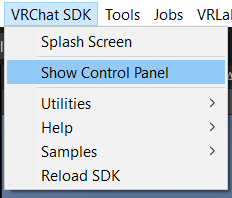 <GreyItalicText>How to open the SDK window.</GreyItalicText>

### Log in to the SDK window {#9d26a270bd2f4ba381e2955f57b85859}

:::caution

The process from here onwards assumes you are using SDK 3.3.0 or later. Older SDKs will look different and have a slightly different upload process.

:::

Enter your VRChat Username/Email and Password in the required fields and press `Sign In`. 

You will be asked for an authenticator code or an email code, enter this as well.

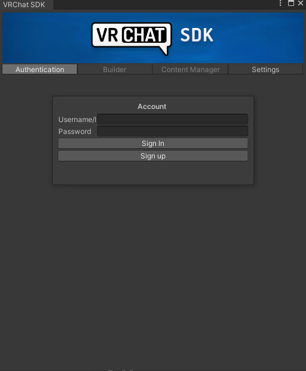 <GreyItalicText>The SDK log in window.</GreyItalicText>

### Upload your avatar for PC {#98e6ed256f48465896f219e128eaf94b}

First, press the `Builder` button at the top of the SDK Window.

In this window:

- Select your avatar from the `Selected Avatar` dropdown. Make sure this is your PC version
- Add a name to the `Name` field
- Add a description to the `Description` field
- Add an image, either by:
	- Selecting a thumbnail from your pc
	- Or Capturing an image from the scene
- Make sure the Selected Platform is Windows
- And press the `Build & Publish` button under the `Online Publishing` tab

Once you’ve done all this, your avatar should be uploaded, congratulations.

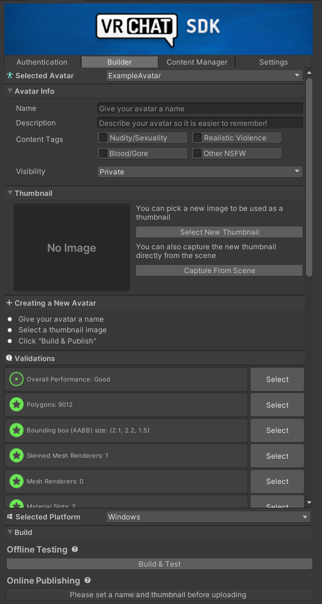 <GreyItalicText>The SDK Builder window.</GreyItalicText>

## (Optional) Upload for quest {#007ebd0cb1f940e594615f00cb050b15}

This step only applies if your avatar comes with a quest version. This is not a guide on making quest versions for your avatar, just on how to upload them.

### Find the Quest Prefab or Scene {#a58b3de7e05b4a1c8e24e9c6c13555f3}

Find the Quest Avatar. It should be in the same place as your PC version.

### Copy the blueprint ID over to the quest prefab {#1c6424c8c3ef4378ac524dac1fbf2579}

Go to the `Content Manager` tab of the SDK. From there, you can find your uploaded pc avatar and press the `Copy ID` button.

Then find the `Pipeline Manager` object on the Quest avatar, paste the ID into the box, and press `Attach (Optional)`. 

 <GreyItalicText>The Pipeline Manager Component</GreyItalicText>

Now, when you upload the avatar, it’ll connect to the PC version.

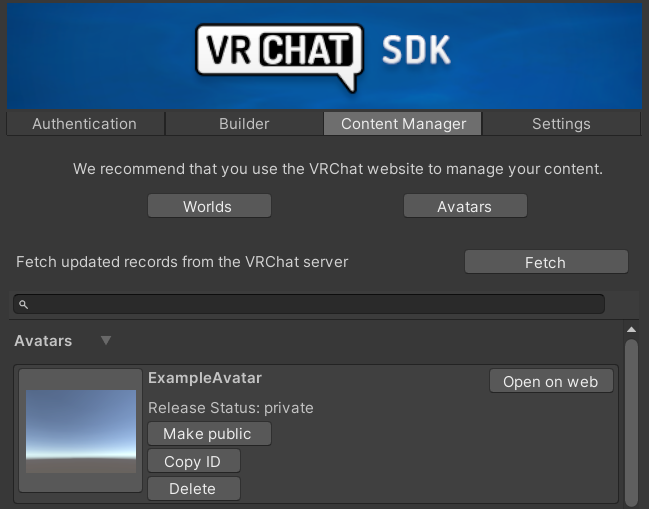 <GreyItalicText>The Content Manager view.</GreyItalicText>

### Change Build Target {#9263dc5cee354c4fa10f020a46d90448}

Select `Quest` in the `Selected Platform` dropdown in the Builder tab.

 <GreyItalicText>The Selected Platform dropdown.</GreyItalicText>

### Upload for Quest {#df5b68a8432e4d75a2bddb5049215355}

In the Builder tab:

- Select your avatar from the `Selected Avatar` dropdown. Make sure this is your Quest version
- Make sure the Selected Platform is Android
- And press the `Build & Publish` button under the `Online Publishing` tab

---
<RightAlignedText>Last Updated: 31 March 2024 08:54:00</RightAlignedText>