Contributors: [Jellejurre](https://jellejurre.dev/), [JustSleightly](https://vrc.sleightly.dev/)

# Combining Layers Using Direct Blend Trees {#e38bde29d45448a6b4081a2072d32728}

Due to the high performance impact of Animator Layers in an Animator Controller, it is often a lot better to combine things such as toggles and radial menus into a single Animator Layer by using a Direct Blend Tree.

## Understanding Direct Blend Trees {#afd25e85748e460eb7d5114d5a2a23af}

Direct Blend Trees allow you to assign a parameter directly to each Animation or Blend Tree child, instead of blending between them. **This allows you to animate more than one thing at the same time in the same Blend Tree.**

For VRChat, we can abuse this behaviour to create multiple toggles and radial puppets within a single Direct Blend Tree, similar to how we would in separate Animator Layers. 

The structure and functionality of a Direct Blend Tree is very similar to that of an Animator Controller, **so it might be easier to understand them if you look at them as if they were Animator Controllers.** This is a very simplified way to look at and understand Direct Blend Trees, so it should be noted that while they are very similar to Animator Controllers, <u>they are</u> <u>**NOT**</u> <u>the exact same!</u> 

:::caution

There are a few key differences between the two which heavily limit the use cases and implementations of Direct Blend Trees compared to Animator Controllers. More info can be found in the Current Limitations And Known Issues section.

:::

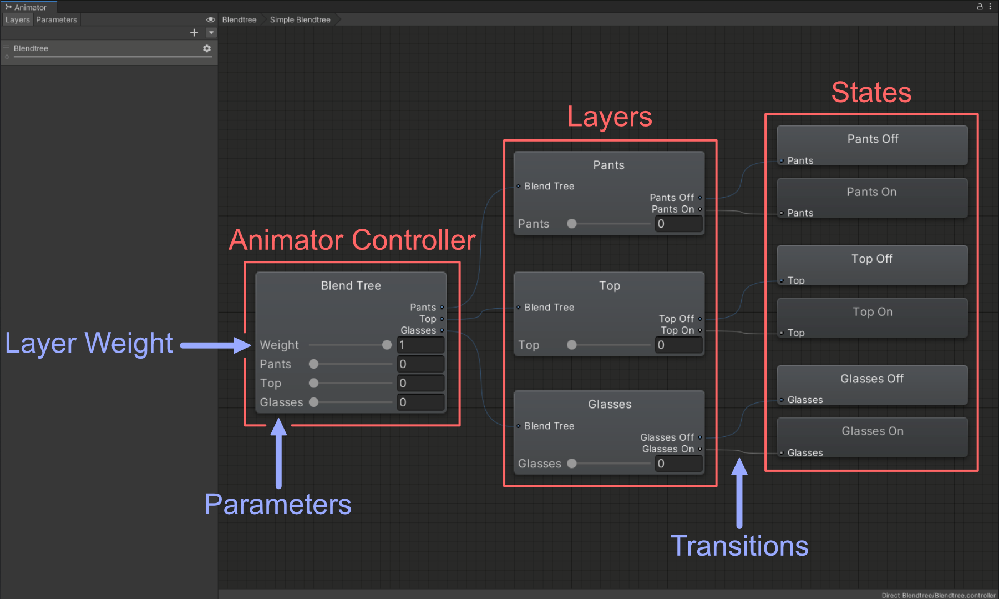 <GreyItalicText>A Direct Blend Tree with 3 Clothing Toggles</GreyItalicText>

---

## Creating Toggles And Radial Puppets {#fbb38b69c7e74a8989fa61ca4b5beba9}

Making toggles and radial puppets in a Direct Blend Tree is not much different or any more difficult than creating a regular toggle in an Animator Layer.

### Step 1 {#6a728cc6cdcd42d195f2ac3abbbab6cc}

- Create a new Animator Layer and right click in any empty space to create a new Blend Tree State

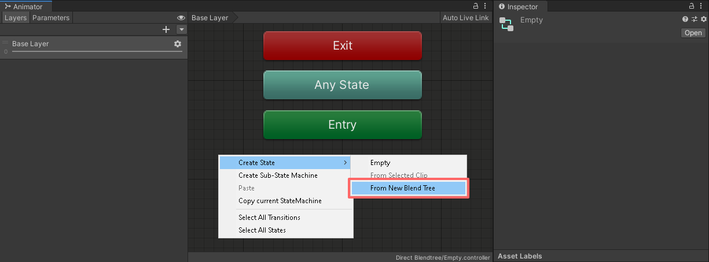

- Set the Write Defaults value of the Blend Tree State to **ON**! This is necessary! We will go into detail about why under the Write Defaults  section

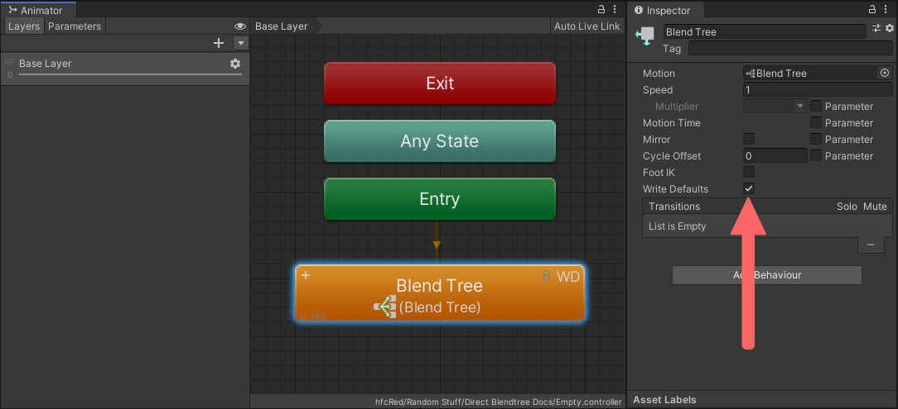

### Step 2 {#204c70c36b5b4e19bd5c51e182ea55a1}

- Double click or right-click the Blend Tree State to open it
- Select the Blend Tree and, in the inspector, change the Blend Type to `Direct`

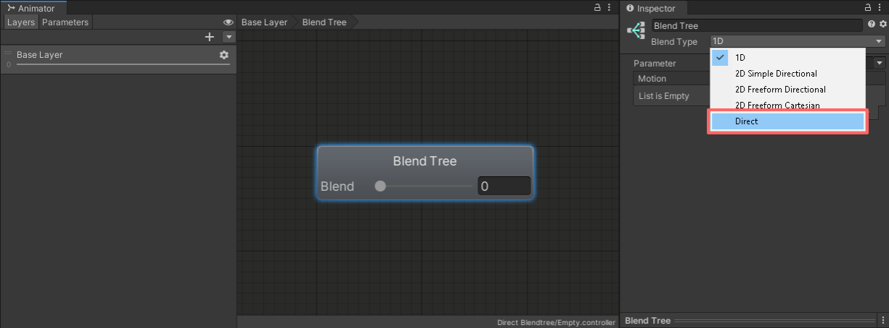

### Step 3 {#ed504c95853f4924adeffb6b125234ad}

- Add a new Blend Tree as a child to the Direct Blend Tree
- If you do not already have one, create a new float parameter in your Animator Parameters list and set its value to 1
	- In this example, the parameter is called `Weight`
	- This is not the parameter that will be used for your toggle itself, it is a separate parameter that sets the weight of the child to 1 so it fully animates, similar to how you set the weight of an Animator Layer to 1
- Set the parameter of the child to the float parameter.
	- You can re-use this float parameter for all the children, you do not need to create a new one for each child
- Make sure the Direct Blend Tree has `Normalized Blend Values` **unchecked**.

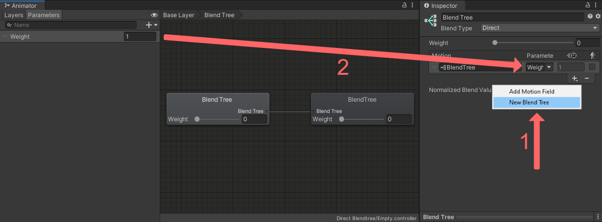

### Step 4 {#73196b652e5b4b6abdd602d287883021}

- Select the child Blend Tree and make sure the Blend Type is set to `1D`
	- You can rename the Blend Tree at the top of the inspector for organizational purposes
- Create a new float parameter for the toggle or radial puppet you are creating, and set it as the parameter of the current child 1D Blend Tree
- Add two new motions as children to this child 1D Blend Tree and put in the same animations you would typically use for your standard toggle or 1D radial puppet
	- If you are used to utilizing single animation clips with **Motion Time** for your radial puppets, you will have to make your animation clips in 1D Blend Tree radial puppet fashion instead

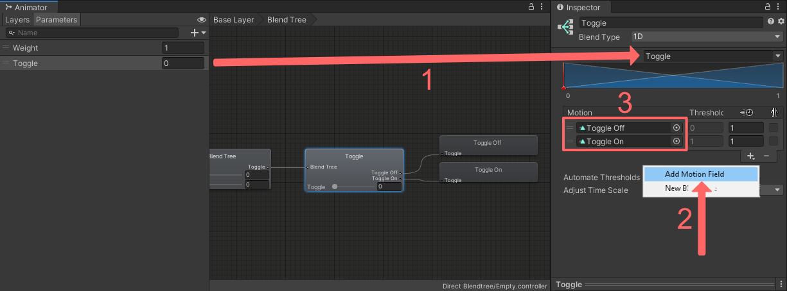

:::caution

Using only one animation clip like you would with a WD On workflow **will not work!** You need separate animation clips or a combined clip.

:::

### Step 5 {#bc1d1e5c41ce4b27ab89d6fee4f3add2}

- Add the parameter that is used by the 1D Blend Tree to your VRChat Expression Parameters List
	- If you are making a radial puppet, set the type to `float`
	- If you are making a toggle, set the type to `bool`
		- This will work due to [Expression Parameter Mismatching](/docs/Other/Parameter-Mismatching)

An example of combining multiple radial puppets and toggles can be found at [Direct Blend Tree Toggle](https://notes.sleightly.dev/justsleightly/Direct-Blend-Tree-Toggle-d40d8b4876b04484809fb8b3f696fbd5).

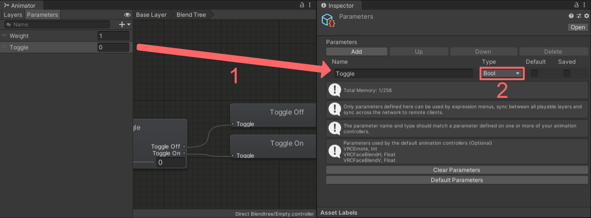

Repeat steps for every toggle and radial puppet you want to create, there is no limit to how many you can add.

An example of combining multiple radial puppets and toggles can be found at [Direct Blend Tree Radials and Toggles](https://notes.sleightly.dev/justsleightly/Direct-Blend-Tree-Radials-and-Toggles-a3113c99bacb44f1902d4d5c7d47c45d).

---

## Write Defaults {#af9b08d723fb47698407a8c0dde577dc}

Direct Blend Trees are an exception when it comes to Write Defaults. **Their Write Defaults value does not have to match that of the rest of your Animator Controller**, meaning it is okay to mix Write Defaults, as long as you do not mix within the same layer.

In the case of Direct Blend Trees this means we can safely use Write Defaults On, even if the rest of the Animator Controller uses Write Defaults Off. This lets us avoid a handful of problems:

Write Defaults Off Direct Blend Trees

- need to be normalized
- need their animations normalized
- are not stable when using multiple Blend Trees
- smoothen their outputs
- can not have an animation as their first child

Therefore <u>it is</u> <u>**NOT**</u> <u>advisable to use Write Defaults Off Direct Blend Trees</u> as they are less stable and a lot more difficult to work with than their Write Defaults On counterpart. Again, it is completely safe to use Write Defaults On Direct Blend Trees even if the entire rest of your Animator Controller uses Write Defaults Off.

You can add the prefix `(WD On)` to the name of your Blend Tree and it will be skipped when using the [https://github.com/VRLabs/Avatars-3.0-Manager](https://github.com/VRLabs/Avatars-3.0-Manager) to set the Write Defaults values of your Animator Controllers.

This is especially useful for Avatar and Prefab creators that want to make sure that users do not accidentally turn off the Write Defaults when using the tool.

:::caution

Changing the Write Defaults value from On to Off <u>**WILL**</u> break the Blend Tree until Write Defaults is turned back to On!

:::

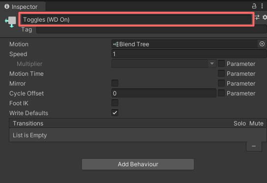

---

## Nesting Direct Blend Trees {#ad33de00d4384f23b1899915f062884d}

If you have a lot of toggles and radial puppets, your Direct Blend Tree can very quickly become really big and hard to read. **You can nest Direct Blend Trees within each other to simulate folders and improve organization.**

If you have already created all your toggles and radial puppets before nesting, you will have to delete and remake them inside their folder, so it is better to account for this in advance (unless you have a [tool to rearrange Blend Trees](https://mcardellje.gumroad.com/l/macs)).

Here we have a Direct Blend Tree containing nine children, we can organize them into folders by utilizing more Direct Blend Trees.

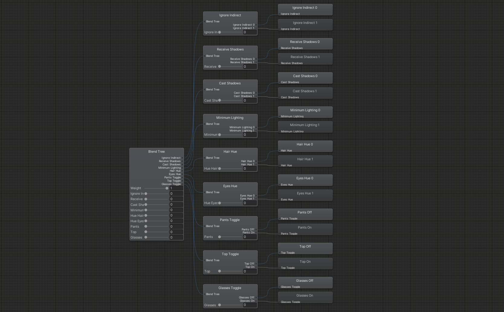

Start by adding a child Blend Tree to your Direct Blend Tree for each folder you would like to create, the same way you would when making a toggle or radial puppet.

Next, select each child and change the Blend Type to `Direct` in the inspector.

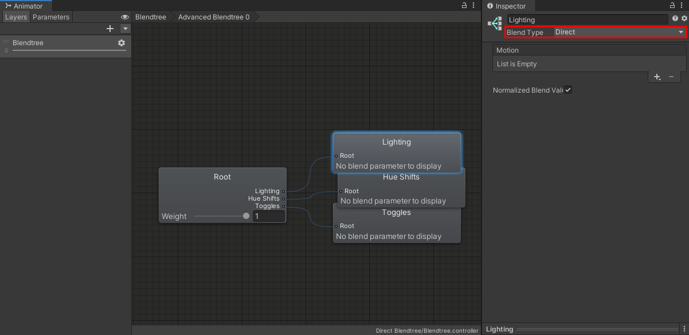

Now simply create your toggles and radial puppets the same way you would in the previous guide, except that now you are creating them from within the folder. 

For better organization you can also rename the folders at the top of the inspector when selecting them.

You can use the same `Weight` parameter from your root Direct Blend Tree described in Step 3 for each of these sub-folders.

An example of combining multiple radial puppets and toggles can be found at [Direct Blend Tree Radials and Toggles](https://notes.sleightly.dev/justsleightly/Direct-Blend-Tree-Radials-and-Toggles-Nested-253ebf5b6c2b4108bae68da6437b1963).

You can double click on any of the Direct Blend Trees to open them in an isolated view, this can be especially helpful when working with a Blend Tree that is causing performance issues due to its size.

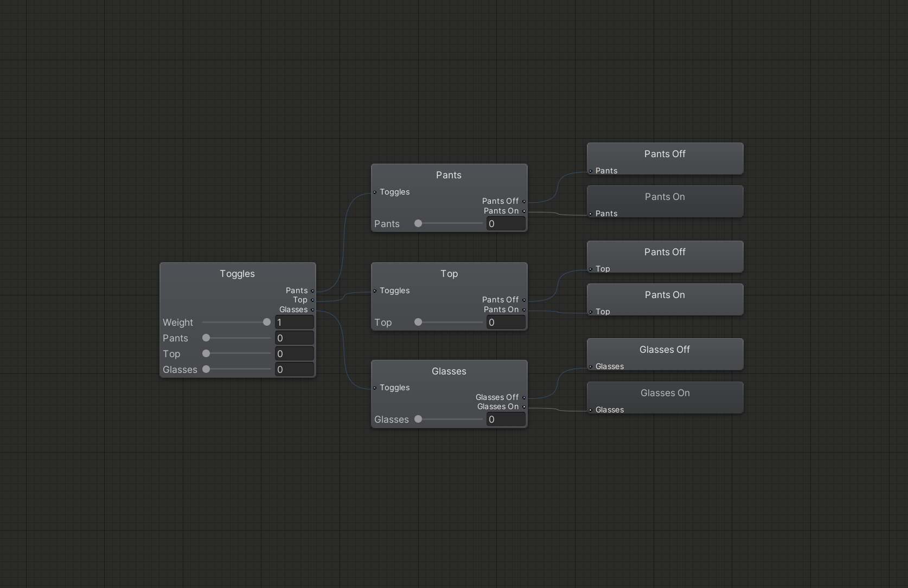

You can navigate back to the full Blend Tree view by clicking on the arrows in the top left corner.

---

## Advanced Blend Tree Techniques {#4d4560585873469889a76f154c457e6c}

Blend Trees can be used for a lot more than just simple toggles and radial puppets, such as:

- Performing basic mathematical operations such as addition, subtraction and multiplication
- Solving mathematical equations such as basic exponential smoothing
- Simulating logic gates such as AND, OR and XOR gates
- Smoothly blending between values
- Figuring out Frame Time

These effects and how to achieve them can be found in the [Advanced Blend Tree Techniques](/docs/Other/Advanced-BlendTrees) article.

---

## Current Limitations And Known Issues {#5a5953728db04478bf7358a30deff360}

- There is no satisfactory solution for driving other parameters, such as for exclusive toggles using parameter drivers
- The values of the animations may be set to 0 for a single frame when entering the Blend Tree for the first time

---
<RightAlignedText>Last Updated: 31 March 2024 09:10:00</RightAlignedText>