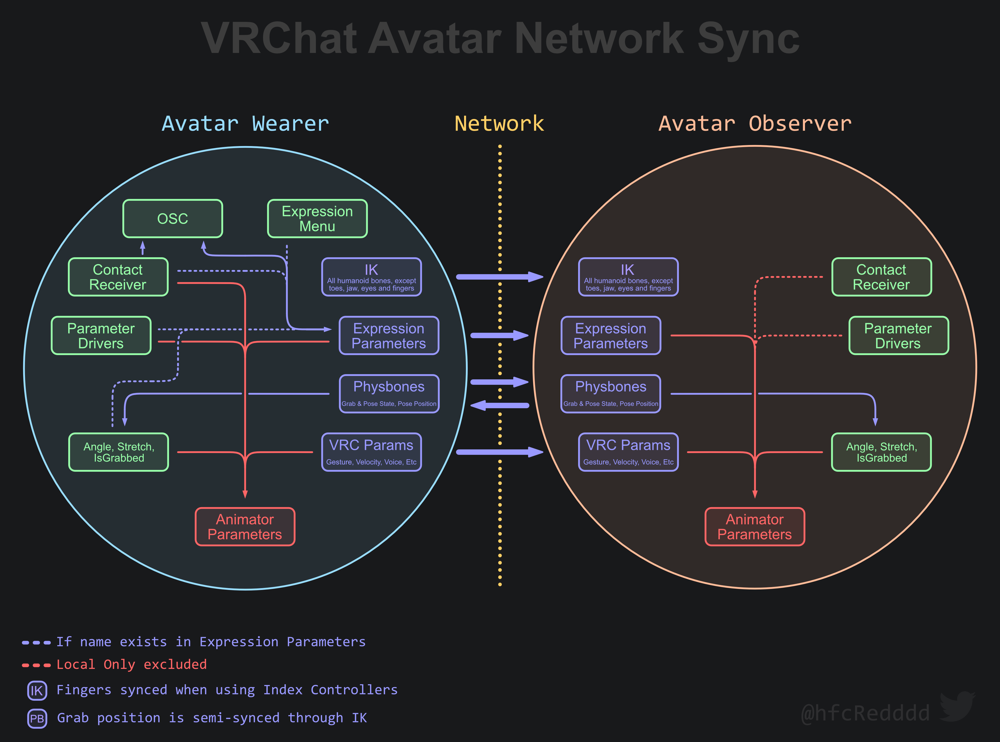
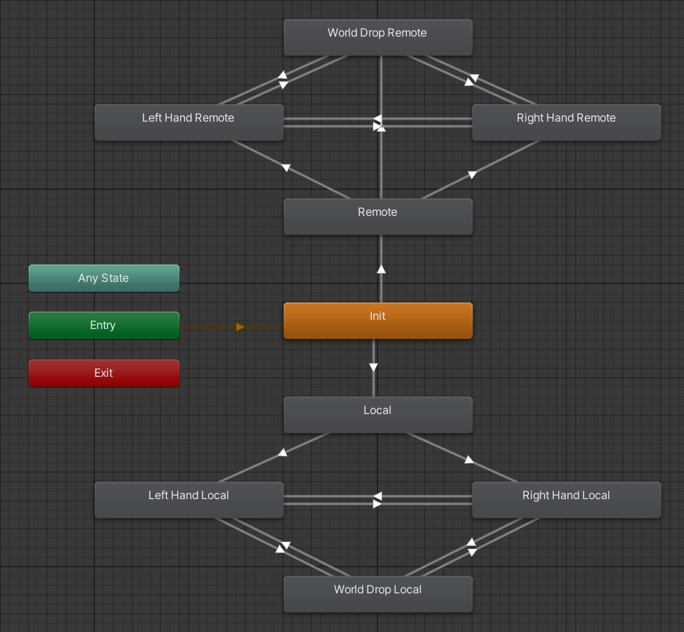

Contributors: [Jellejurre](https://jellejurre.dev/), [JustSleightly](https://vrc.sleightly.dev/)

# Network Sync {#8f8c0b1fcdba42c9b23c4a799fead1f0}

In VRChat, only a limited amount of information is sent over the network. This is done to save costs for VRChat, as anything your avatar sends out has to be sent to every single person in the instance.

Every player runs a local instance of VRChat. To make sure everyone sees approximately the same game on their screen, data has to be sent between the instances.

However, sending the position of every object every frame would cost way too much bandwidth.

---

## Synced Data {#61dd229167b04022a03bd78a206d1267}

There are only a few things that are sent over the network, and the rest is handled locally by the VRChat instances.

---

### IK Targets {#e445344423c24710921a4687b92f8074}

IK Targets are the parts of the body that get tracked by VRChat to determine how your avatar should pose. This is combined with the Playable Layers to get the final result of the movement of the Avatar. The IK targets for different platforms are: 

	- Desktop: Head, Jaw, Left Hand, Right Hand
	- 3pt Tracking: Head, Jaw, Left Hand, Right Hand
	- 6pt / FBT Tracking: Head, Jaw, Left Hand, Right Hand, Hip, Left Foot, Right Foot
	- Note: Index players also get their fingers position synced
---

### Expression Parameters {#8af0640fe72e4859a2f57e51476cb6fe}

The parameters marked as Synced in your Expression Parameters List are synced.

This means that parameters that are not marked as synced are not sent over the network and should only be used by driving them by Parameter Drivers and by Expression Menus.

Note that not the full values are sent over the network, but only some parts of them:

- `Int`: Only numbers 0 to 255 are synced.
- `Float`: Only multiples of 1/127 between -1 and 1 are synced (so -1, -126/127, … 126/127, 1).
- `Bool`: True or False
---

### PhysBones {#41fc2124e7704054a7e7d80baed66d21}

PhysBones send their Pose Position over the network to late joiners.

---

### Built-In VRC Parameters {#5c688000a928476cb7272318288f0b65}

This includes Speed and their derived parameters, but also Gesture, Velocity, Voice, and all the other parameters found in the [Built-In VRC Parameters](/docs/Avatars/VRC-Parameters).

---

## System Set Up {#0af0207834ec41978b1ec27eeec1d442}

In VRChat, to allow for late joiners to see your systems in the way you intend them to be seen, it is best to split your Animator Controller Layers up in two sides, divided by the IsLocal parameter.  One local side that does all the logic, processes contacts, and sets Synced parameters, and one remote side that only does visualization.

An example of this can be seen on the right, where the local side processes all logic of where the object is supposed to be, while the remote side processes just the visualization of where to display the object.

 <GreyItalicText>An example late join synced system.</GreyItalicText>

---

## Object Sync {#3c5a45375f844b578679548f22f35203}

Generally, most objects don’t need to have their position synced, as they are connected to your body. However, any object that gets world dropped using a [World Constraint](https://github.com/VRLabs/World-Constraint) will not appear in the right spot for late joiners. 

This can be remedied by using one of VRLabs’ Sync packages. Right now the only publicly available one is the [15-Bit-Position-Rotation-Networking](https://github.com/VRLabs/15-Bits-Position-Rotation-Networking) package, or [Juzo’s World Sync](https://github.com/JuzoVR/WorldSync), though that one can only be used through the Non-Destructive Avatar Systems VRCFury and Modular Avatar, so it can’t be fully installed in the editor.

---
<RightAlignedText>Last Updated: 03 April 2024 08:05:00</RightAlignedText>