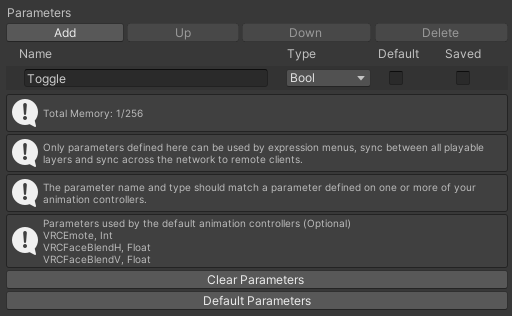
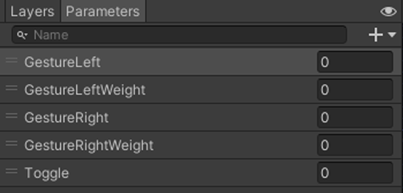

Contributors: [Jellejurre](https://jellejurre.dev/), [JustSleightly](https://vrc.sleightly.dev/)

# Expression Parameter Mismatching {#1381b80d68b4470f8e8ed104521cf4c0}

In typical VRChat Avatars 3.0 creation, VRChat expression parameters are expected to be set as the same parameter type (`Bool`, `Int`, `Float`) as their respective local animator parameter counterparts.

However, parameters between your Expression Parameters vs your local animator parameters can have mismatched parameter types and still function. This behaviour differs from type to type, and is documented below.

 <GreyItalicText>A parameter labeled Toggle added to VRChat Expression Parameters as a Bool</GreyItalicText>

 <GreyItalicText>A parameter labeled Toggle added to local animator parameters as a Float</GreyItalicText>

---

## Verified Parameter Mismatch Behaviour: {#5f563ebf52ea44ff8597e6b2d0a53948}

### Expression Parameter Bool:

| Animator Controller Parameter | Expression Bool = False | Expression Bool = True |
| ----------------------------- | ----------------------- | ---------------------- |
| Bool → Bool                   | Bool = False            | Bool = True            |
| Bool → Int                    | Int = 0                 | Int = 1                |
| Bool → Float                  | Float = 0.0             | Float = 1.0            |

### Expression Parameter Int:

| Animator Controller Parameter | Behaviour                                       |
| ----------------------------- | ----------------------------------------------- |
| Int → Bool                    | Any Int value that isn’t 0 sets bool to True    |
| Int → Int                     | Expected Behaviour                              |
| Int → Float                   | Straight Conversion:  Ex: Int = 2 → Float = 2.0 |

### Expression Parameter Float:

| Animator Controller Parameter | Behaviour                                      |
| ----------------------------- | ---------------------------------------------- |
| Float → Bool                  | Any Float value that isn’t 0 sets bool to True |
| Float → Int                   | Rounded Conversion: ≥0.5 → 1 : \<0.5 → 0       |
| Float → Float                 | Expected Behaviour                             |

---

## Why does mismatching work? {#ea79f2b19900472cb27828cb4b9d193c}

Unity Animators use floats on the C# back-end regardless of parameter type, while VRChat uses SBytes instead of bools, ints, or floats.

The Animator window and VRCSDK themselves makes the user experience simpler by allowing you to select the parameter types from the interface.

In this sense, the parameters are not being casted but **mismatched**.

Mismatching parameters also works with the [VRChat native parameters](https://docs.vrchat.com/docs/animator-parameters#parameters).

---

## Testing in Unity {#b201270cb4f54614a5a47dc1f991bbae}

At this time of writing:

[**Av3Emulator**](https://github.com/lyuma/Av3Emulator) has implemented the above parameter mismatching behaviour.

[**Gesture Manager**](https://github.com/BlackStartx/VRC-Gesture-Manager) has implemented the above parameter mismatching behaviour for all parameters but vrc builtin parameters, but is working on that for their 3.8.9 release.

---
<RightAlignedText>Last Updated: 31 March 2024 08:54:00</RightAlignedText>