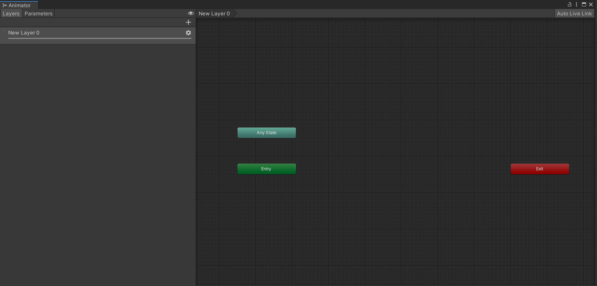
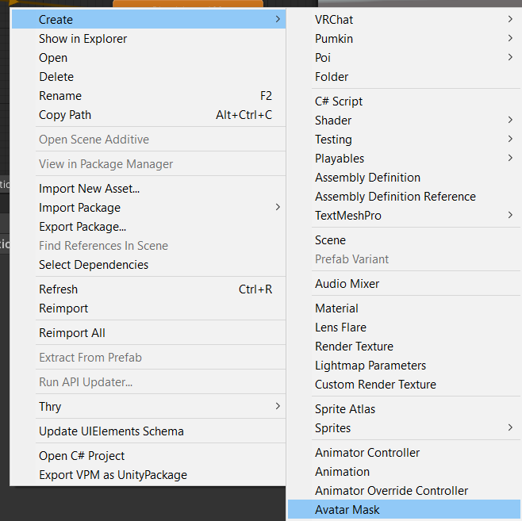
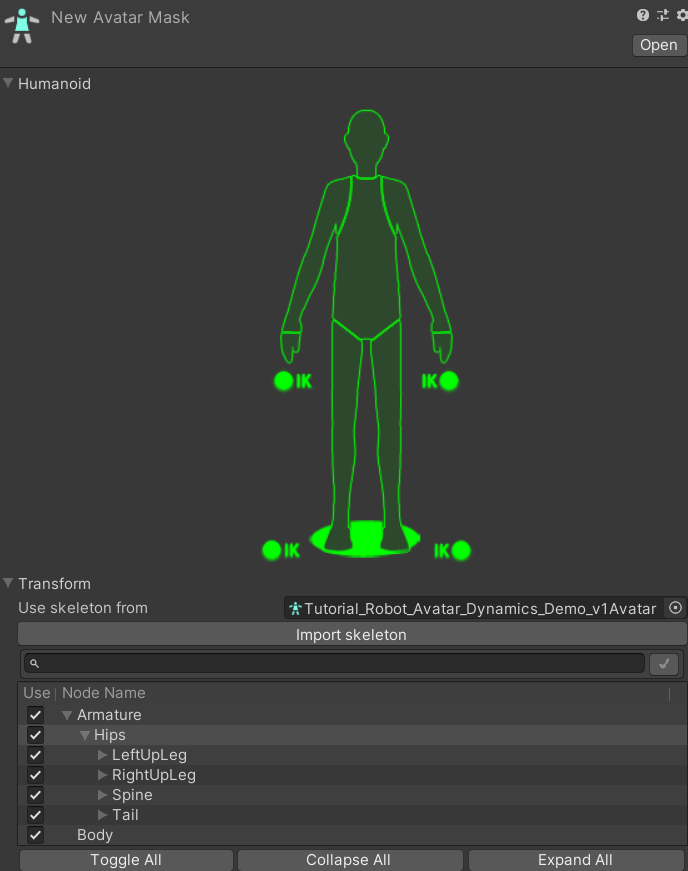

Contributors: [Jellejurre](https://jellejurre.dev/), [JustSleightly](https://vrc.sleightly.dev/)

# Animator Controllers {#f30edb1fc17943ccb4431928633db645}

An Animator Controller is an asset designed to play animations on a GameObject and its children when placed in an Animator. Its function is to blend together multiple Animator Layers into one final list of effects to apply to an animator. More information on how Animators turn the output of the Animator Controller into actual changes on the avatar can be found at [Animators](/docs/Unity-Animations/Animators).

## Animator Layers {#15d540eac7f24d74a9c128bb954af934}

An Animator Layer allows us to create a State Machine of Animator States, which includes a set of Animator States, an initial Animator State, and transitions between States. One Animator Layer is always either playing one Animator State, or transitioning (blending) between two Animator States. New layers can be added by pressing the `+` button in the top right of the Layer view.

Animator Layers start with three default “States”:

- The `Any State`: This State is a symbolic State representing all states. So a Transition going from the `Any State` is the same as a Transition from every State on the Animator Layer.
- `Exit` & `Entry` States: Any Transition going into the `Exit` State will evaluate the transitions coming from the `Entry` State, transitioning to the first state it can, or the Default state if no matching transitions are met.

Note: The Default State is the State colored orange. It can be changed by performing a `Right-Click` on another state and selecting `Set as Layer Default State`. This is also the State the Layer will start in.

 <GreyItalicText>A Default Animator Layer</GreyItalicText>

---

## Parameters {#b6ebd14f57994e38909a2ab1aad75e90}

Animator Controllers use parameters to control the currently active State in their State Machines. Parameters are checked to see if the current State should transition to the next State. 

More information about the usage of Parameters can be found at the [Animator Transitions](/docs/Unity-Animations/Animator-Transitions) page. Parameters come in different types: `Bool`, `Int`, `Float`, and `Trigger`.

- `Bool` parameters can be either true or false, and are generally used for basic logic that requires only two values: on or off.
- `Int` parameters store whole numbers, so 0, 1, -10 or 10293, but not 0.5 or-1.1. They are generally used for exclusive logic, for example if you have five different outfits to switch between.
- `Float` parameters store decimal values like 0.5, 1.7, -1 and 1024.123. They are the only parameters which can be used in Blend Trees (more information on them can be found at [Blend Trees](/docs/Unity-Animations/BlendTrees)), and can only be compared using Greater Than or Less Than, not Equals (since it represents a point on the number line).
- `Trigger` parameters are like `Bool` parameters in that their value is either true or false, however they automatically get set back to false whenever they are used to change state. This makes them useful for triggers, but since there is no built-in VRChat equivalent, they do not find much use in VRChat.

:::caution

Parameters that are synced by VRChat Expression Parameters do not retain their full range when being sent over the network to remote players. Specifically `Int` parameters get clamped between [0, 255] and `Float` parameters get clamped to [-1, 1] but only multiples of 1/127.

:::

---

## Advanced Details {#67c4f0f9db13442d9cca4b8d8504fe20}

### Blend Weight & Blending Mode {#1fcf44d0951f4741a86544baebffd70d}

In play mode or in game, the Motions (Animation Clips/BlendTrees) of the currently playing Animator States of all layers get blended together by the Animator Controller to the final result. 

This is done by taking the first value as the base and then iteratively blending each layer below it to obtain the current one. The blending is done based on the Blend Weights, where the effects get multiplied by the Blend Weight.

How the layers are blended together depends on the Blending Mode.

Blending Mode `Override` gives us the following formula:

$NextValue = CurrentValue + NewWeight \cdot (NewValue - CurrentValue)$

While Blending Mode `Additive` gives us the following formula:

$NextValue = CurrentValue + NewWeight \cdot NewValue$

Example: 

One Animator Layer is in an Animator State with an Animation Clip which sets a BlendShape to 50, and has a weight of 1 (the first layer always has a weight of one).

Another Animator Layer with Blending Mode set to `Override` is in an Animator State with an Animation Clip which sets the same BlendShape to 100, and has a weight of 0.5.

Now the final applied value for the BlendShape will be 50 + 0.5 * (100 - 50) = 75.

 <GreyItalicText>An animator layer and its config. Note that the topmost layer cannot have its weight changed. It will always be set to 1.</GreyItalicText>

 <GreyItalicText>A second animator layer, which can have its weight changed.</GreyItalicText>

:::caution

The Blend Weight value gets set to 0 by default, which means the layer is inactive. To activate the layer, set the Blend Weight to a higher value, typically 1.

:::

---

### Avatar Masks {#85a87b13eecb4388a28219d53ff8ef2c}

Avatar Masks mask out certain parts of the current playing animation. They can be created in the `Right Click` → Create → Avatar Mask

In their inspector, you can enable and disable certain Humanoid Muscles and Transforms for being animated. This allows you to reuse one animation in multiple places by masking off certain parts of the animation.

To disable Transforms on your avatar, you have to put the Avatar from your FBX into the `Avatar` slot, and press the `Import Skeleton` button. This will show all the Transforms on the FBX and allow you to enable/disable them.

More information on the effects of Avatar Masks, both in Unity and in VRChat, can be found at [Avatar Masks](/docs/Avatars/Avatar-Masks). 

 <GreyItalicText>Creating an Avatar Mask</GreyItalicText>

 <GreyItalicText>The Avatar Mask Inspector. This area can be used to enable and disable certain Humanoid Muscles and Transforms for being animated.</GreyItalicText>

---

### Sync / Timing {#b267da1dee7748388058be6654e5d8f2}

The `Sync` Checkbox allows you to sync up two layers, except for the animations. This means that the State Machines are the exact same, and whatever State the source Layer is in, the synced Layer is in. This merges the two current Animation Clips/BlendTrees together based on Layer Weight and Blend Mode. 

With the `Timing` checkbox off, the synced Layer’s animation will be stretched or squished to take the same time as the source Layer.

With the `Timing` checkbox on,  the synced Layer’s animation and the source Layer’s animation’s timing will be combined to make the final time based on the Layer Weights.

 <GreyItalicText>What syncing two layers together looks like in the Inspector. Here, the Synced layer has the exact same State Machine as the Source Layer, except for the animations in those states.</GreyItalicText>

---

### IK Pass {#65c98427e2ee4ccf8e77f0f6c3c92d3c}

If the `IK Pass` checkbox is enabled, a script on the same GameObject will receive the `OnAnimatorIK(int LayerIndex)` callback. This callback can be used to update the IK Targets based on the position of objects animated by the Animator. This is completely useless for VRChat content where external scripts can't be uploaded.

---
<RightAlignedText>Last Updated: 31 March 2024 08:54:00</RightAlignedText>