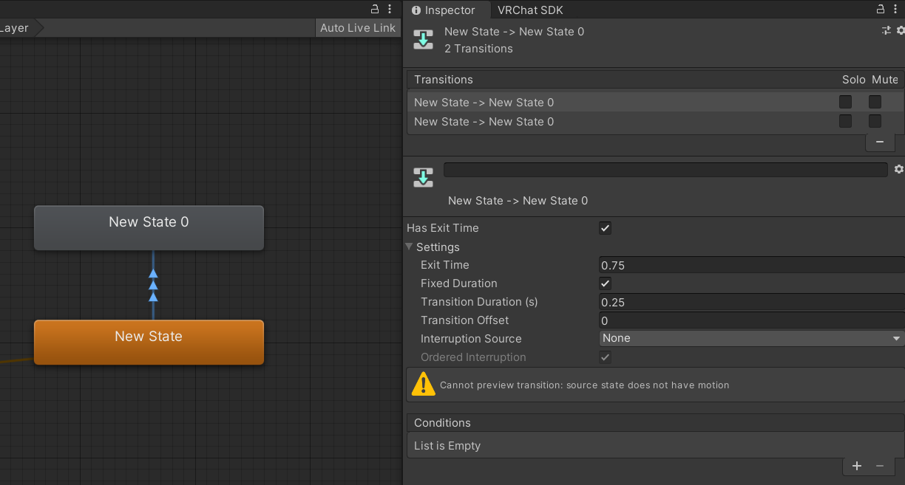
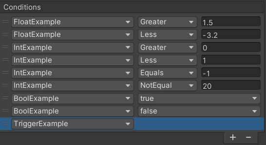
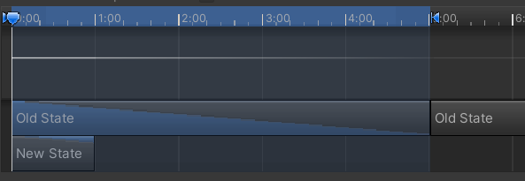

Contributors: [Jellejurre](https://jellejurre.dev/), [JustSleightly](https://vrc.sleightly.dev/)

# Animator Transitions {#9906fdc43d324e208c1536e1cf9a106c}

An Animator Transition connects two Animator States and is triggered when its conditions (if any) are met, and its exit time has passed. Access its settings by opening the Settings dropdown. 

To create a new Animator Transition, right-click the source Animator State, choose "Make Transition," and click the target Animator State. 

Multiple transitions can connect the same two states, indicated by three arrows on the line instead of one.

 <GreyItalicText>A default Animator Transition, going from New State to New State 0.</GreyItalicText>

---

## The Transitions List {#915140e0e1b8451d8524dcddd3c9b13d}

The transition list, labeled `Transitions` at the top of the Animator Transition Inspector, contains Animator Transitions. 

If multiple transitions exist between two states (indicated by three arrows), they can be selected and reordered by clicking and dragging. Details on transition execution order are available on the [Animator States](/docs/Unity-Animations/Animator-States)  page.

The `Mute` field disables a specific transition, while the `Solo` field disables all other transitions. These features are not commonly used. 

You can rename an Animator Transition using the text field below the Transitions List.

 <GreyItalicText>Two Animator States, connected by two Animator Transitions. The top one is selected,, which is shown by the lighter gray color.</GreyItalicText>

---

## Condition List {#bb46c7cef0ca4d6aa176fc699e61a7a3}

The `Condition List` is a list of Animator Conditions on an Animator Transition marked `Conditions`. It contains all the conditions that must simultaneously be met to trigger the Animator Transition. To add a new Animator Condition, click the `+` button at the bottom of the `Conditions List`. To remove a highlighted Animator Condition, press the `-` button.

Different Animator Conditions include:

- **Float:** Target can be any floating-point (fraction) number.
- **Int:** Target can be any Integer (whole) number.
- **Bool:** Target can only be True or False.
- **Trigger:** Doesn't have a target; triggers when enabled, consuming and disabling the trigger.

For AND logic (both conditions must be met), place two conditions on one Animator Transition. 

For OR logic (either condition triggers the transition), use two separate Animator Transitions, each with one Animator Condition.

Example:

Consider two conditions in the `Conditions List`: `IntExample Greater 1` and `FloatExample Less 9.5`.

- If `IntExample` is set to 1 and `FloatExample` is set to 5, the transition won't trigger because `IntExample` isn't Greater than 1, requiring all conditions to be met.
- If `IntExample` is set to 2, the transition triggers since all conditions are met.

 <GreyItalicText>An example Condition List with every possible Animator Condition type shown. Note how the TriggerExample Animator Condition is selected and would be deleted if the - button would be pressed.</GreyItalicText>

---

## Any State {#bb378c1ca4174620965e34c7bb8f5c1d}

`Any State` transitions are special transitions created by `Right Clicking` the blue `Any State`, selecting `Make Transition`, and choosing the target Animator State. These transitions differ from normal Animator Transitions as they act as if the Animator Transition originates from all Animator States, making them triggerable from any state. They also possess the unique ability to interrupt any transition (see Interruptions).

An additional option exclusive to `Any State Transitions` is `Can Transition To Self`, determining whether the target Animator State can transition to itself using this particular Animator Transition.

 <GreyItalicText>An example Any State Transition. Note the extra Can Transition To Self option.</GreyItalicText>

---

## Exit Time {#d4a93dddc29c46e696854c21ca9d2c47}

The `Exit Time` field allows an Animator Transition to be triggered once a fraction of the source Animator State’s Animation Clip has passed. To enable/disable it, check/uncheck the `Has Exit Time` checkbox. States without a clip count for a duration of 1 second.

Example:

For a transition from `Old State` to `New State` with `Exit Time` set to 1.5, and `Old State` having an Animation Clip of 2 seconds, the transition can be triggered only after `Exit Time * Clip Length` = 1.5 * 2 = 3 seconds have passed.

:::caution

Single keyframe Animation Clips are considered to have a length of 1 second for Exit Time. It's recommended to create clips with 2 keyframes, each 1 frame apart, to avoid confusion.

:::

---

## Transition Duration {#9e4e0513b4bd4b8a991a8178b8655704}

The `Transition Duration` field sets the duration of an Animator Transition, determining how both Animator States’ Animation Clips blend during the transition. At the beginning, the source Animator State’s Animation Clip is fully playing, and at the end, the target Animator State’s Animation Clip is fully playing.

If the `Fixed Duration` checkbox is checked, the `Transition Duration` represents the time in seconds (s). If unchecked, it's a fraction of the length of the source Animator State’s Animation Clip (displayed as a percentage, but it's a fraction where 1 = 100%).

Example: 

For a transition from `Old State` to `New State` with `Transition Duration` set to 4 and `Fixed Duration` enabled, 3 seconds into the transition, `Old State`’s Animation Clip plays with 25% weight, and `New State`’s Animation Clip plays with 75% weight. 

If `Fixed Duration` is disabled, and `Old State` has a 2-second Animation Clip, the transition would take `Transition Duration * Clip Length` = 4 * 2 = 8 seconds.

---

## Advanced Details {#6e7827288c394017ac6296ded42d93f1}

### Transition Offset {#9ec91f51f6b842fab3e575462b8967bf}

The `Transition Offset` field sets the offset of the Animation Clip in the target Animator State as a fraction. For instance, if set to 0.5, at the beginning of the Animator Transition, the Target Animator State’s Animation Clip starts playing at 50% through its runtime.

---

### Interruptions {#c8b72e6a74b74711a67161dff3521b1f}

During an Animator Transition, if another transition that can interrupt the current one is triggered, it pauses the ongoing transition, captures the current state of the two Animation Clips, and starts the new transition. The "Source" here is a snapshot of those effects, and its length is the length of the Animation Clip in the source state.

#### Interruption Source

The `Interruption Source` field determines which Animator Transition can interrupt the current one, offering five options:

- **None:** Allows only AnyState Transitions to interrupt.
- **Current State:** Allows AnyState Transitions and transitions from the source to target Animator State to interrupt.
- **Next State:** Allows AnyState Transitions and transitions from the target to any other Animator State to interrupt.
- **Current State then Next State:** Allows AnyState Transitions, then transitions from the source to target Animator State, then transitions from the target to any other Animator State to interrupt.
- **Next State then Current State:** Allows AnyState Transitions, then transitions from the target to any other Animator State, then the transition from the source to target Animator State to interrupt.

Note: The order matters; it takes the first allowed Animator Transition it finds.

The `Ordered Interruption` field, when checked, allows only transitions higher than the selected Animator Transition in the list to interrupt it.

---

### The Visual Transition Editor {#e32f471f540f4d0f8e219cb4046748c9}

The Visual Transition Editor is a visual tool that allows you to edit properties like `Exit Time`, `Transition Duration`, and `Transition Offset` for Animator Transitions. It appears when either the source or target Animator State has an Animation Clip.

The editor is intuitive, and you can:

- Change the start and end of the transition by dragging the blue start and finish markers at the top of the timeline.
- Adjust the beginning and end time (and duration) of transitions by dragging the transition at the top of the timeline.
- Modify the offset of the target Animation Clip by dragging the bottom Animation Clip left to right.

The white line at the top is the Pivot Weight of both animations over time. This is the most stable point between the left and right foot of the avatar, where the left foot is 0 and the right foot is 1. This is affected by animating the Root Transform Position with Bake Into Pose disabled. This is practically useless, but for if you were ever wondering :)

 <GreyItalicText>An example of the Visual Transition Editor.</GreyItalicText>

In this Visual Transition Editor example:

- **Exit Time:** 0, as the transition starts at the beginning of the Old State.
- **Transition Offset:** 0, as the transition begins at the start of the New State.
- **Old State’s Animation Clip:** Has Loop Time on, indicating it repeats after the first play.
- **New State’s Animation Clip:** Has Loop Time off, signifying it doesn't repeat after the first play.
- **Transition Duration:** Set to 1, with Fixed Duration off, implying the transition lasts the full duration of the Old State’s Animation Clip.

---
<RightAlignedText>Last Updated: 31 March 2024 08:54:00</RightAlignedText>